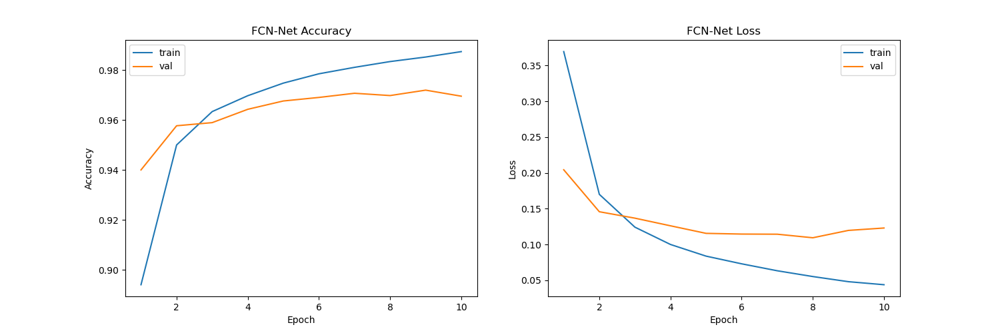
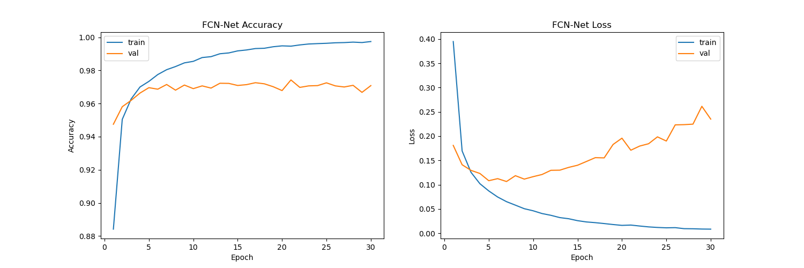
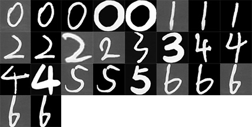

# 2024.11.17  16：54  阴雨

# 实验总结

训练 epoch=10 时 accuracy、loss 如下：

分类效果：

- 数据集(自制)photo：Not good

- 数据集mnist：None

训练 epoch=30 时 accuracy、loss 如下：

分类效果：

- 数据集(自制)photo：a little better
- 数据集mnist：None

# 自制数据集 photo

图片部分来源于网络，共26*2张，其中photo_surce有8张来源于网络，1张未使用，剩余17张来自真人手写。photo中为对源图片进行黑白处理过后的样本，未使用全部图片。

## 预处理

工具：PS

## 示例数据：

